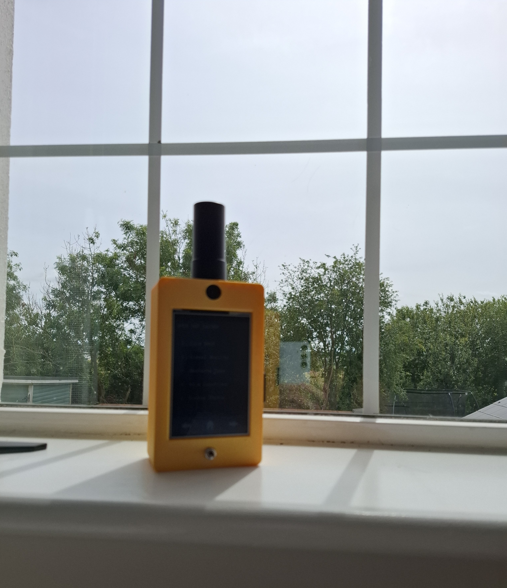
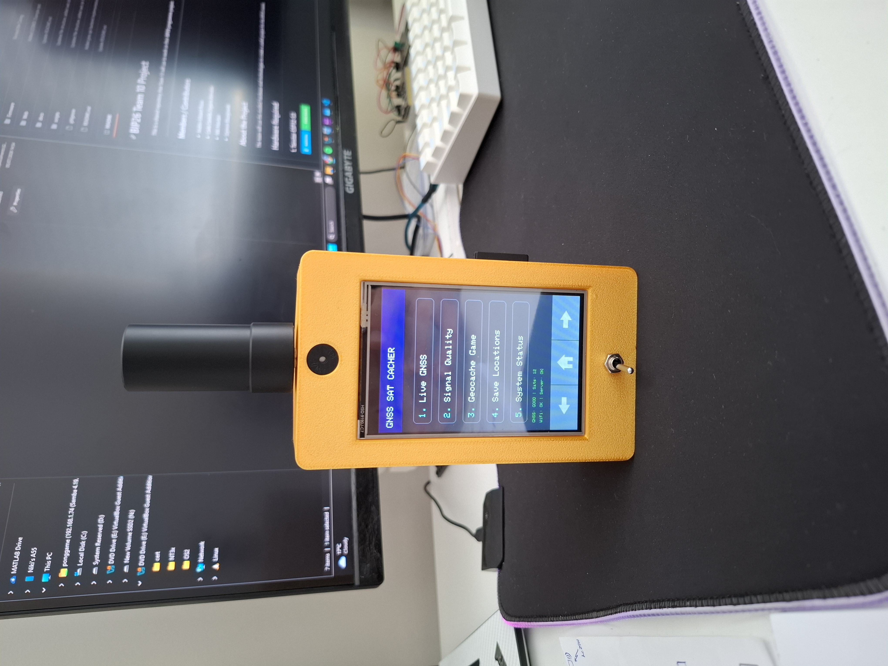
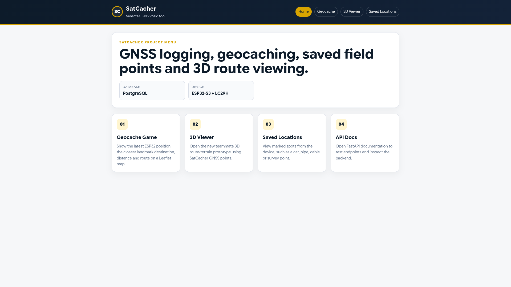
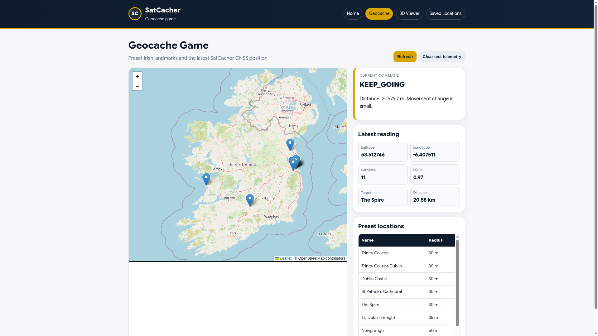
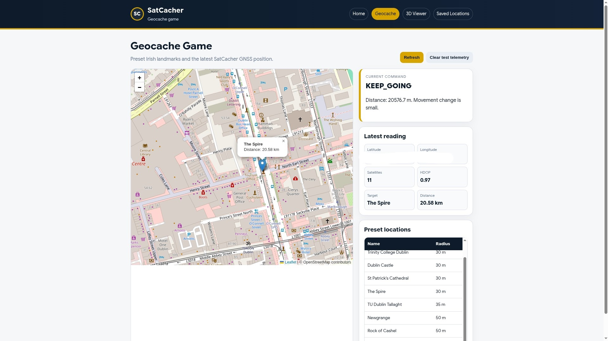
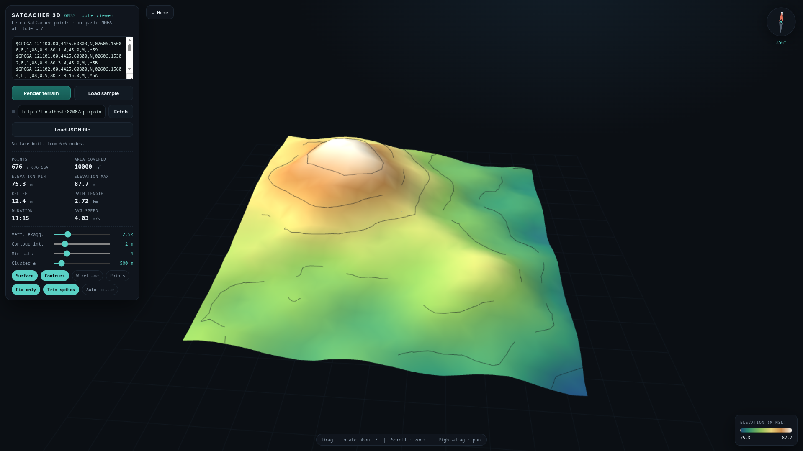
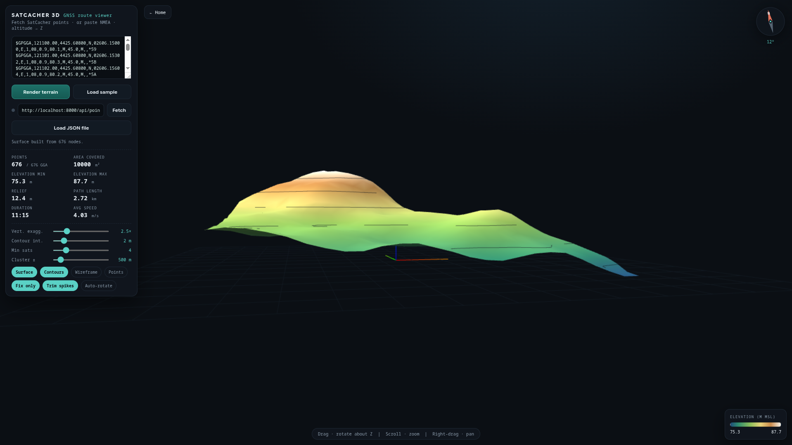
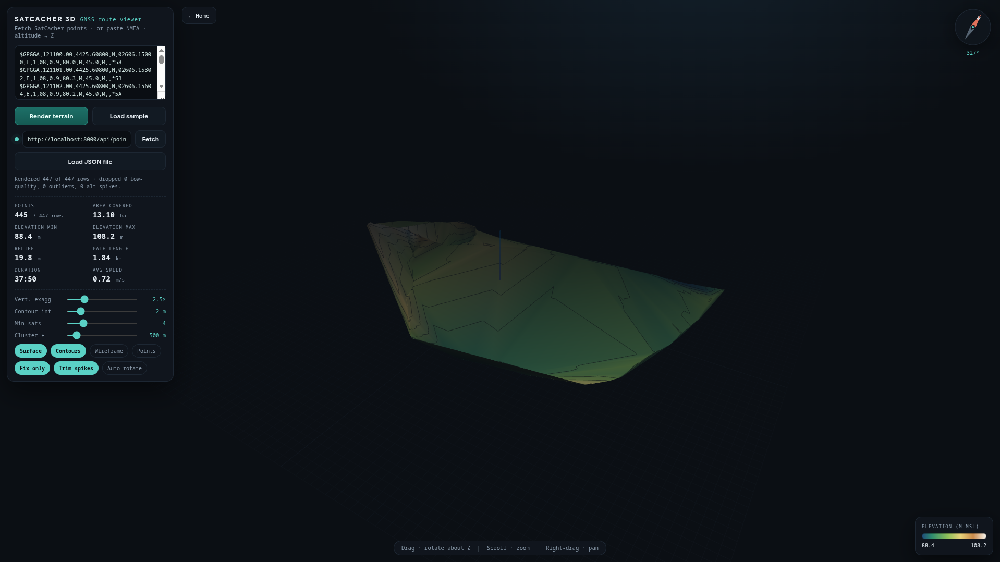
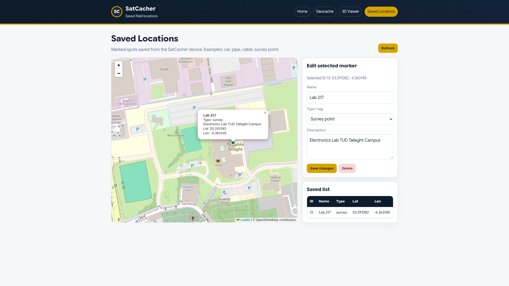

# G-Cacher

**A portable GNSS surveying and location-mapping tool**

  

  
  
  
  
  

---

## Overview

G-Cacher is a student engineering project developed during the BIP26 programme. The project utilizes a portable GNSS device. A web platform for collecting, storing, and visualising location data.

---

## What it currently does:

Device:

* Reads live GNSS data from multiple satellite constellations
* Displays position, altitude, speed, satellite count, HDOP, and signal quality
* Logs selected GNSS data to an SD card
* Sends telemetry to a backend server

Webserver (Frontend/ Backend):

* Visualises recorded location points in a web dashboard on a map
* A GeoCache-style navigation game
* Display recorded latitude, longitude, and altitude points in 3D
* Saves and displays saved locations

---

## Device Interface

The device uses a touch-based menu system for viewing live data and interacting with the project features.

The main device menus include:

* Live GNSS — displays parsed position, altitude, speed, HDOP, satellite count, date, and time.
* Signal Quality — shows whether the current GNSS signal is good, usable, weak, or unavailable.
* NMEA / Logging — supports viewing GNSS data and saving records to SD card.
* Saved Location — records a location and sends it to the backend as a saved asset.
* System Status — shows device, sensor, SD card, and telemetry status.

  

---

## Web Platform

The web platform receives telemetry from the G-Cacher device and provides a simple interface for interacting with the collected location data.

It includes a frontend website and a FastAPI backend. The backend receives device telemetry, stores records, and provides endpoints for the frontend. The frontend allows users to view location data, play the GeoCache game, inspect saved assets, and visualise terrain points. Deploy easily with Docker.

  <strong>SatCacher Home Page</strong> 
  

---

## GeoCache Game

The GeoCache Game is a location-based feature designed for tourists or first-time visitors exploring Ireland.

The backend stores predefined landmarks. The G-Cacher device sends the user’s current location to the server, and the web platform calculates whether the user is getting closer to or further away from the target.

The device can then give simple direction feedback:

* **Red** — getting closer
* **Blue** — moving further away
* **Yellow** — not enough movement detected yet

  <strong>GeoCache Game</strong> 
  

  <strong>Sample Waypoint</strong> 
  

---

## 3D Terrain Viewer

The 3D Terrain Viewer displays recorded or simulated GNSS points using latitude, longitude, and altitude.

It can be used to visualise walking routes, field test data, campus areas, and rough terrain-like surfaces. Points can come from the FastAPI database, imported JSON files, or simulated data.

  <strong>3D Terrain Viewer</strong> 
  

  <strong>Sample Terrain</strong> 
  

  <strong>TUD Tallaght Campus Terrain</strong> 
  

---

## Saved Locations

The Saved Locations feature allows the device to record an important location and send it to the backend as an asset.

On the web dashboard, saved points can be viewed on a map and given extra details such as a name, category, and description. This can be used for marking parked cars, survey points, field markers, underground pipes, cables, or other important positions that may need to be found again later.

  <strong>Saved Locations</strong> 
  

---

---

## Hardware

### Tenstar ESP32-S3

### LC29H(AA) GNSS Receiver

### ILI9488 4.0 Inch

---

## Learning Portal / Wiki

The wiki contains the more detailed technical documentation for GNSS, NMEA, sensors, wiring, software setup, and project development.

---

## Future Improvements

Future improvements may include:

* Further documentation
* Sensor Fusion with extended Kalman filtering
* PCB
* Improved enclosure

---

## Contributors

* Andrei-Eduard Rusu
* Carla Daniela Zegarra Bernabe
* Niki Mardari
* Szymon Blazejowski

---
---

## Notes

Contributions, suggestions, and improvements are welcome.
